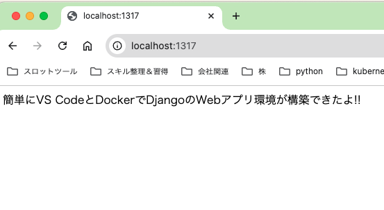

# vscode_docker
VS Code上でDjango+Nginx+Postresql+Pgadminのコンテナを起動するためのDocker資材

## 前提
- ローカルの端末にDockerコンテナの開発環境を作ることを目的としている
- Docker Desktopが端末にインストールされていること
- VS Codeが端末にインストールされていること
- 以下のVS Code 拡張機能がインストールされていること
  - Dev Containers
  - Remote - SSH: Editing Configuration Files

## 起動方法
- Docker Desktopを起動
- 以下のコマンドでリポジトリをクローン
```
# git clone
git clone https://github.com/yamamuratkr/vscode_docker.git
```
- VS Codeでcloneした`vscode_docker/docker/webapp`を開く
- 「コンテナで再度開く」をクリックするとコンテナが起動する


- Docker Desktopを確認するとコンテナが起動している様子が確認できる


## Djangoの動作確認
- ブラウザで以下のURLを入力してDjangoアプリに接続確認
  - URL: http://localhost:1317



## Djangoを育てる
- コンテナが起動できたらあとは好きにDjangoを育てていけば良い
- `python manage.py startapp xxxx`で新しいアプリを作成できる
- viewsを作成することで新しい機能を追加する
- CSSやjavascript, 画像は`nginx/static`に置くと画面に適用される
